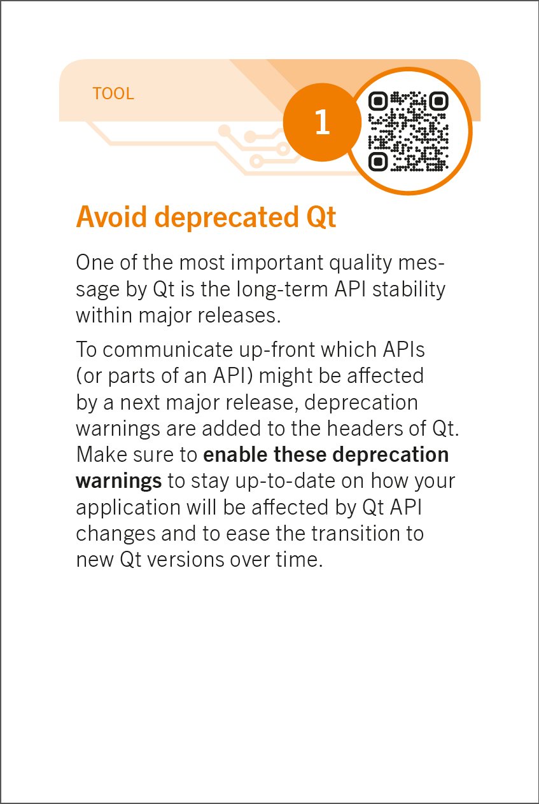

# Avoid deprecated Qt

| Topic                 | Details |
|-----------------------|----------------------------|
| Goal                  | New code should not make use of Qt APIs already marked deprecated. Avoid unpleasant surprises by keeping an eye on deprecated APIs.|
| Description           | Qt is deprecating APIs or parts of APIs during its minor release cycles. Deprecated API stays around till the next major release. The compiler can give warnings when such APIs are used. |
| Environment           | Qt/C++ |
| Platform              | All |
| Implementation effort | Very minimal when introduced early on. |
| Applicability | New projects, new modules within existing projects. As a preparation for a porting effort. |
| Caveats| Might conflict with Wall/Werror. Might be hard to apply when extending existing code bases|
| See also              | |

## Implementation hints

Variant1: my.pro

```shell
QMAKE_CXXFLAGS += -Wdeprecated
DEFINES += QT_DEPRECATED_WARNINGS
```

Generates one warning for each use of a Qt method marked as deprecated.
Very coarse grained. No specific Qt version can be selected.

Variant2: my.pro

```shell
DEFINES += QT_DISABLE_DEPRECATED_BEFORE=0x050200
```

Removes everything what is deprecated since Qt 5.2 from the headers.


